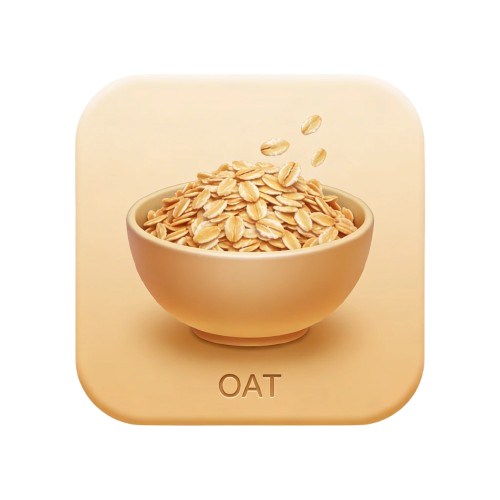
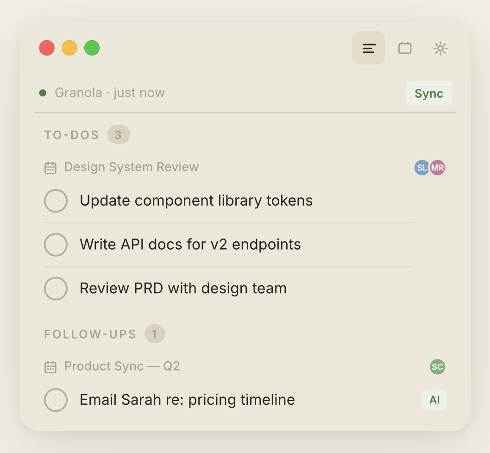

<div align="center">
  
  <h1>Oats</h1>
  <p><strong>A floating macOS panel that turns your Granola meeting notes into action.</strong></p>
  <p>
    <a href="https://github.com/dtventures/oats/releases/latest">
      
    </a>
    
    
  </p>
  <br>
  
  <br><br>
</div>

---

Oats sits quietly in the top-right corner of your screen. Every time you finish a meeting in [Granola](https://granola.so), Oats reads the notes and extracts every action item and follow-up — sorted, labelled, and ready to act on before you've even closed the tab.

## Features

| | |
|---|---|
| ⚡ **Always up to date** | Syncs with Granola every 30 seconds |
| ✦ **Sorted by Claude** | AI separates to-dos from follow-ups automatically |
| 📋 **Notes always there** | Read the full meeting summary for any task |
| ✉️ **Emails in seconds** | Draft follow-up emails with recipient + context pre-filled |
| ⌨️ **Pure keyboard flow** | ↑↓ navigate · ↵ complete · G open · E email · C Claude Code |
| 🤖 **Claude Code ready** | Hand off any task to Claude Code with full meeting context |

## Requirements

- macOS 14 (Sonoma) or later
- A [Granola](https://granola.so) account
- Your Granola API key (Settings → API in Granola)

## Installation

1. Download **Oats.dmg** from the [latest release](https://github.com/dtventures/oats/releases/latest)
2. Open the DMG and drag Oats to your Applications folder
3. Launch Oats — it will live in the top-right corner of your screen
4. Open Settings (gear icon) and paste your Granola API key
5. Hit **Sync** — your action items will appear immediately

> **Gatekeeper note:** Because Oats is not yet notarized with Apple, macOS may show a security warning on first launch. Right-click the app → **Open** → **Open** to bypass it.

## Keyboard Shortcuts

| Key | Action |
|-----|--------|
| `↑` `↓` | Navigate items |
| `↵` or `Space` | Mark complete |
| `G` | Open meeting in Granola |
| `E` | Draft follow-up email |
| `N` | View meeting notes |
| `C` | Hand off to Claude Code |
| `Esc` | Deselect |

## CLI

Oats also ships with a full terminal interface:

```bash
# Interactive TUI
oats

# List all items
oats list

# Force a sync
oats sync
```

Install the CLI by copying the `oats` binary from the app bundle to your PATH:

```bash
cp /Applications/Oats.app/Contents/MacOS/oats /usr/local/bin/oats
```

## Building from Source

Requires Xcode 15+ and Swift 5.9+.

```bash
git clone https://github.com/dtventures/oats.git
cd oats
./build.sh
open dist/Oats.app
```

To build a signed DMG for distribution:

```bash
./build.sh --sign
```

## Privacy

All data stays on your machine. Oats reads your Granola notes via the Granola API and stores extracted tasks locally at `~/Library/Application Support/Oats/`. Nothing is sent to any external server.

---

<div align="center">
  <p>Made for Granola users who ship things.</p>
</div>
